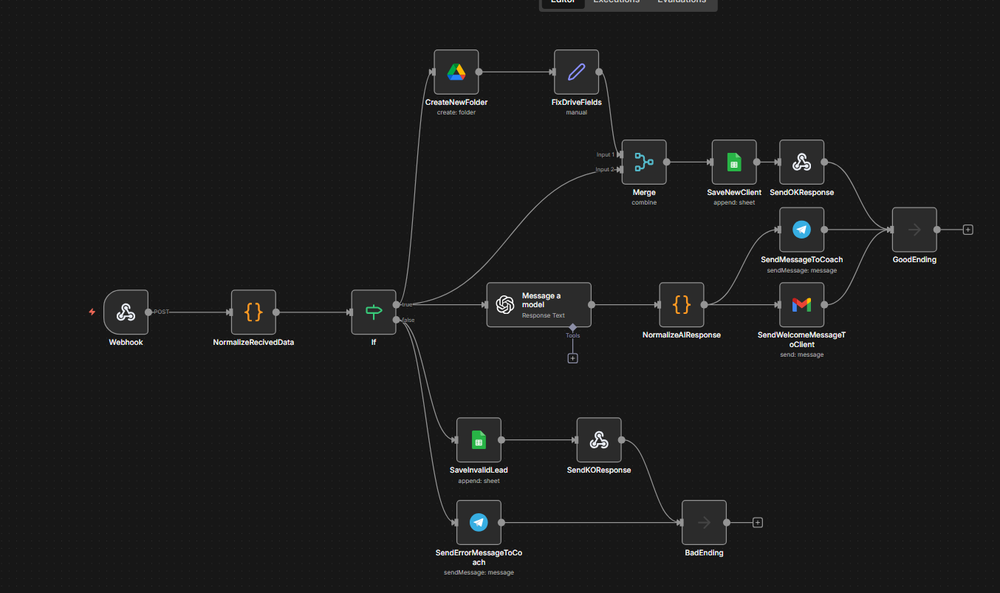
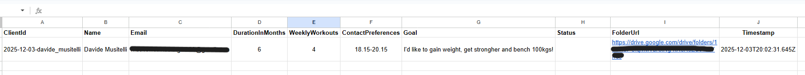
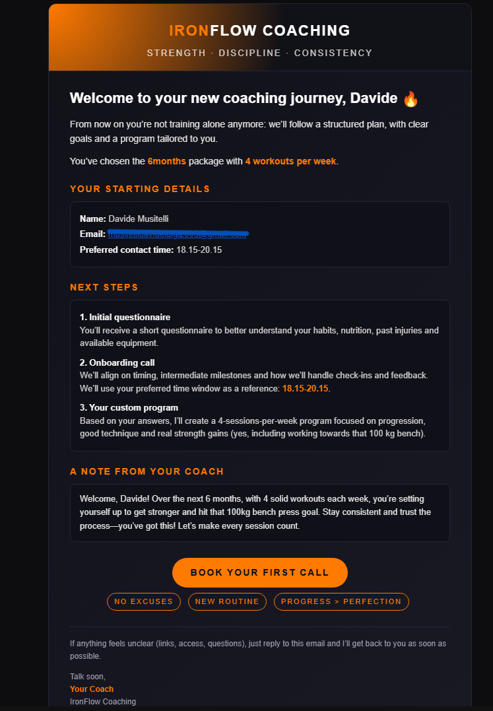
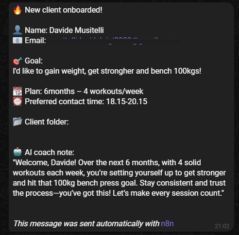
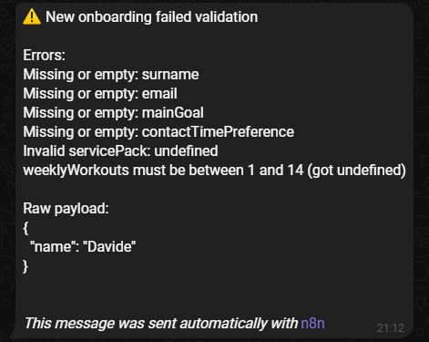

# Online Coach Lead Intake Automation (n8n)

Automation workflow for online coaches / trainers that turns a raw lead form
into a complete onboarding flow:

- input validation
- Google Sheets “mini CRM”
- Google Drive client folder
- AI-generated encouragement message
- welcome email to the client
- Telegram notification to the coach
- error logging + error notification

---

## Workflow overview

This is the full n8n workflow:



---

## Problem

Typical online coach workflow:

- collects leads via forms / DMs
- manually copies data into a spreadsheet
- creates a folder for each client by hand
- writes a custom welcome email from scratch
- has no clear log of invalid / broken submissions

Slow, error-prone, and impossible to scale.

---

## What this workflow does

When a new lead submits a form (via webhook), the workflow:

1. **Normalizes & validates the input**
   - required fields:
     - `name`, `surname`, `email`
     - `servicePack`, `weeklyWorkouts`
     - `mainGoal`, `contactTimePreference`
   - validates:
     - email format
     - `weeklyWorkouts` within an allowed range
   - generates a stable `clientId` for each lead
   - adds flags:
     - `isValid: true | false`
     - `validationErrors: string[]`

2. **Happy path – valid leads (`isValid = true`)**
   - creates a **client folder** in Google Drive  
     (e.g. `2025-12-03-davide_musitelli`)
   - appends a row to a **Clients** Google Sheet with:
     - personal data (name, email, goal, etc.)
     - plan (`servicePack`, `weeklyWorkouts`)
     - Drive folder URL
     - timestamp
     - `status = WELCOME_SENT`
   - calls OpenAI to generate a short, **personalized encouragement message**
     based on:
     - goal
     - plan duration
     - weekly workouts
   - sends a **HTML welcome email** to the client
   - sends a **Telegram message** to the coach with:
     - all client details
     - goal
     - plan info
     - folder URL
     - AI encouragement message
   - returns a **JSON 200 OK** response from the webhook.

3. **Error path – invalid leads (`isValid = false`)**
   - appends a row to a separate **InvalidLeads** Google Sheet with:
     - timestamp
     - `validationErrors`
     - raw payload (`rawPayload`)
   - sends a **Telegram alert** to the coach with:
     - the list of validation errors
     - raw payload for debugging
   - returns a **JSON error** response from the webhook.

---

## Data destinations

### 1. Google Sheets – valid leads

Clients sheet example:



Typical columns:

- `clientId`
- `name`, `surname`, `email`
- `servicePack`, `weeklyWorkouts`
- `mainGoal`
- `contactTimePreference`
- `folderUrl`
- `timestamp`
- `status` (e.g. `WELCOME_SENT`)

### 2. Google Sheets – invalid leads

A second sheet (`InvalidLeads`) stores:

- `timestamp`
- `validationErrors` (joined as a single string)
- `rawPayload` (JSON stringified)

This provides a simple audit log of broken submissions and helps improve the frontend form over time.

---

## Client experience – welcome email

The client receives a clean HTML welcome email with:

- their name and plan
- a recap of goal and next steps
- the AI-generated encouragement message

Example:



---

## Coach experience – Telegram notifications

### Valid lead (OK)

The coach gets a concise Telegram summary with:

- name, email
- plan & weekly workouts
- goal
- preferred contact time
- Drive folder URL
- AI encouragement message



### Invalid lead (KO)

If the submission fails validation, the coach gets an alert that includes:

- human-readable list of validation errors
- raw payload (for debugging / manual follow-up)



---

## HTTP responses

The webhook returns structured JSON, useful for custom frontends:

- `200 OK`
  ```json
  {
    "status": "ok",
    "message": "Onboarding workflow started.",
    "clientId": "2025-12-03-davide_musitelli"
  }

- `400 Bad Request`
    ```json
    { "status": "error", "message": "Invalid data.", "errors": [ "…", "…" ] }

- `Example payload`
    ```json
    {
    "name": "Davide",
    "surname": "Musitelli",
    "email": "example@example.com",
    "servicePack": "6months",
    "weeklyWorkouts": 4,
    "mainGoal": "I'd like to gain weight, get stronger and bench 100kg.",
    "contactTimePreference": "18.15-20.15",
    "timestamp": "2025-12-03T19:12:13.614Z"
    }
    
## Stack & nodes

- Trigger: Webhook
- Logic: Function, IF, Merge
- Storage: Google Sheets (Clients, InvalidLeads)
- Files: Google Drive (client folder)
- AI: OpenAI (message generation)
- Email: Gmail (HTML welcome message)
- Messaging: Telegram (coach notifications)

---

### The exported workflow is available in this folder as:
online-coach-intake.json
You can import it directly into n8n and adapt:
  - Field names
  - Sheet IDs
  - Drive folder
  - Email templates
  - Telegram chat ID
to match your environment.